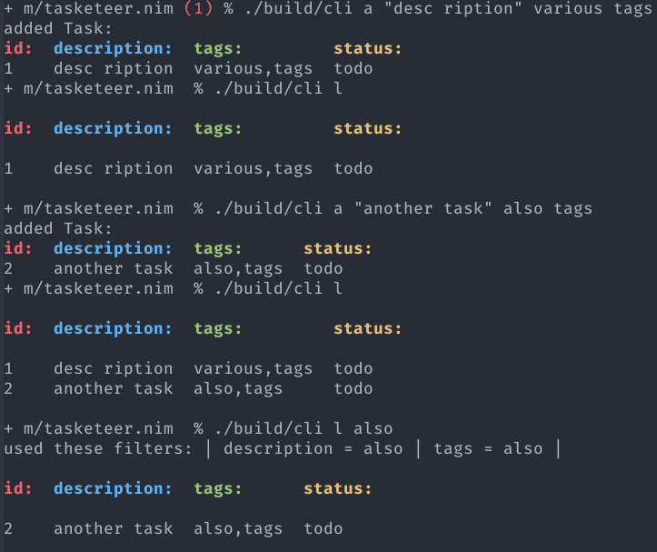

# Tasketeer.nim

Tasketeer is a task app, inspired by taskwarrior, using a modular approach to frontend and
backend.

The backend is a dynamic library implementing the backend interface. This library
is picked up at runtime using the the `config.json` to pick.

*(currently there is only a sqlite backend)*

The frontend uses the backend interface to manage the data and is concerned
with displaying the data and gathering user inputs.

*(currently there is only a cli frontend)*

## Usage

Currently the paths are relative, so you have to navigate to the project root.

Install dependencies.

`nimble install`

Compile sqlite backend.

`nim c ./src/backend/sqlite/sqlite.nim`

Compile cli frontend.

`nim c ./src/frontend/cli/cli.nim`

It should compile to `build/cli` (using the args from `config.nims`).

Run it:

`./build/cli`

It should spit out a help message for the CLI usage (since running it without a
subcommand is invalid usage).

```
Usage:
  cli {SUBCMD}  [sub-command options & parameters]
where {SUBCMD} is one of:
  help    print comprehensive or per-cmd help
  list    lists tasks according to filter
  add     adds new task. Usage: task add <description> [<tag> ...]
  new     like `add`
  remove  removes tasks according to filter
  delete  like `remove`
  modify  change fields of filtered tasks
  update  like modify

cli {-h|--help} or with no args at all prints this message.
cli --help-syntax gives general cligen syntax help.
Run "cli {help SUBCMD|SUBCMD --help}" to see help for just SUBCMD.
Run "cli help" to get *comprehensive* help.
```

Also it should create a `task.db` file in the project root, which is a SQLite DB.

Then you can run any subcommand like

`./build/cli add <description> <tags>`

and

`./build/cli list`

## Config

Currently the `config.json` file is responsible for the configuration data.
Just because JSON is very easy to work with in nim.
This could be changed to YAML, TOML or INI (or maybe even nimscript) in the future.

The `config.json` is currently in the project root and kinda static since there
aren't really any options worth changing.

Later there shall be a feature to look up default locations for config files
(like `XDG_CONFIG_HOME` etc.) and a default location for the `task.db` file and
all that, but ATM it's all kept in the project root.

## Subcommands

The only thing that's not self explanatory (I think) is how the `filter` works.
You can specify it for various subcommands to filter which tasks to access.

A filter can be:
* 1 number, which will be interpreted as a task ID
* 1 string equal to a member of the enum `TaskStatus`
* 1 string __not__ equal to a member of the enum `TaskStatus`. It will then
  be be used to filter both in `description` and in `tags` using the `LIKE` operator
  from SQL
* 2 strings. It will try to parse the 1st one as a `TaskStatus` and use the rest
  as `description` and `tags` again. Mind that using `TaskStatus` and
  `description`/`tags` is implemented using the `AND` operator, since it makes
  sense, if you specify both, you probably want a task fitting the `status` and
  the text.

## Pictures




